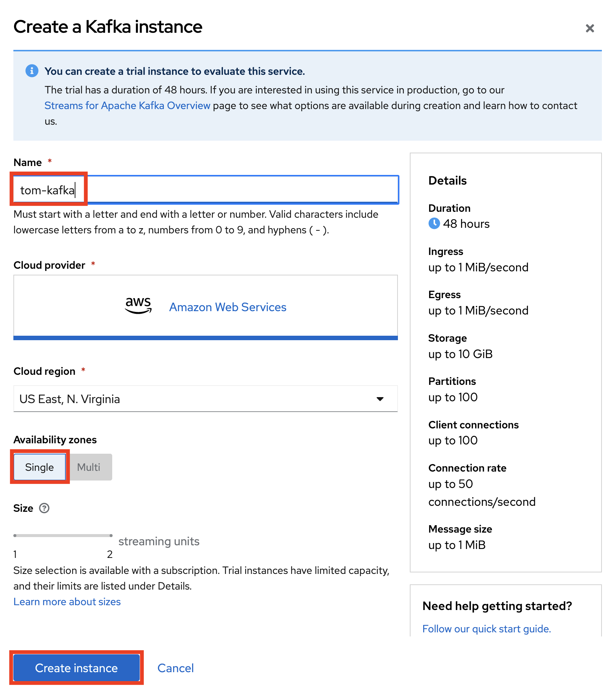
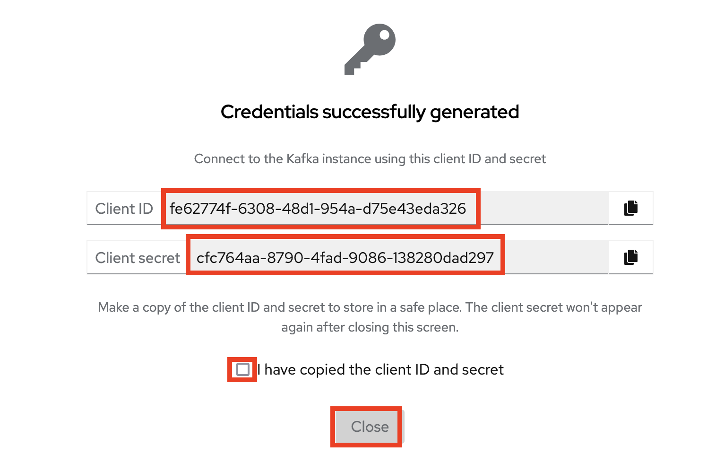
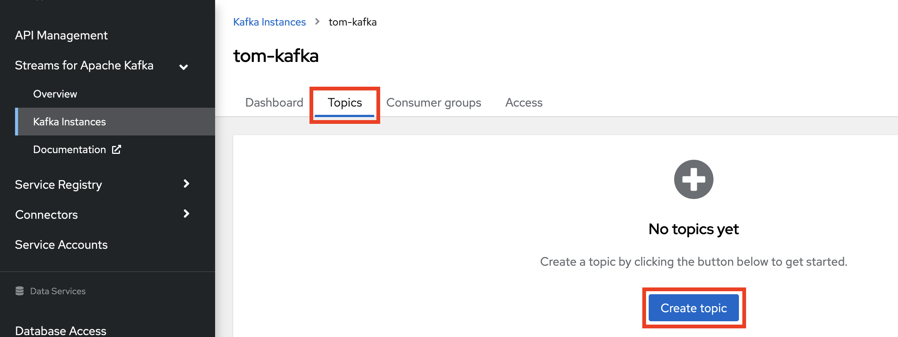
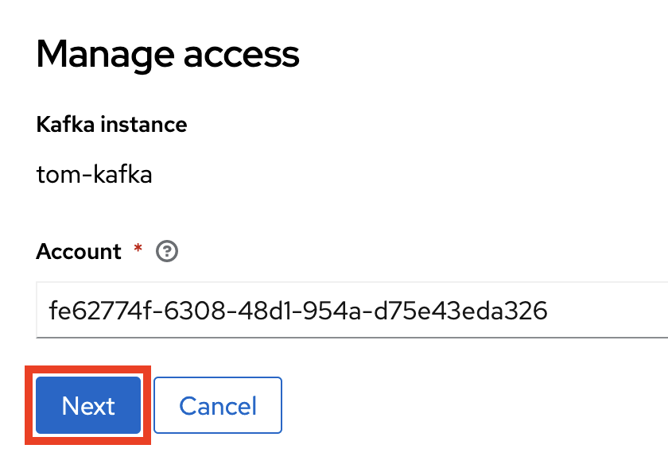
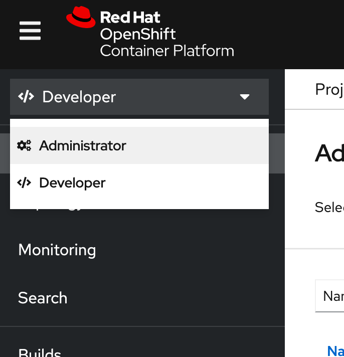
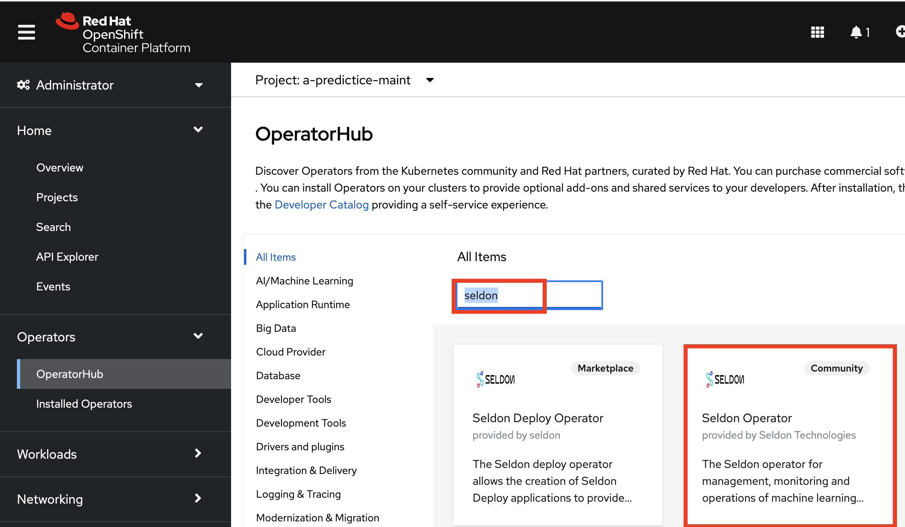

# Setting up the Inference Demo

## 1 - Download the OpenShift CLI

Navigate to [OpenShift CLI Download Page](https://docs.openshift.com/container-platform/4.10/cli_reference/openshift_cli/getting-started-cli.html). (use the newest version - selectable on the top of the page)

Follow the instructions to download the ***oc*** client and add it to your system path.

## 2 - Download the Workshop Files

Using the example below:   
1. Clone (or fork) this repo.
2. Change directory into the root directory of the cloned repository **predictive-maint**.  
3. Create a variable *REPO_HOME* for this directory

```
git clone https://github.com/odh-labs/predictive-maint.git
cd predictive-maint
export REPO_HOME=`pwd`
```


## 3 - Setup Kafka Cluster on Red Hat OpenShift Streams for Apache Kafka (RHOSAK)
First, Login to **https://console.redhat.com** - you may need to create a free account.

Navigate to **Application and Data Services > Streams for Kafka > Kafka Instances**

or just hit:   [https://console.redhat.com/application-services/streams/kafkas](https://console.redhat.com/application-services/streams/kafkas)

### Create Kafka Instance

Click **Create Kafka instance**


Name it, stick with a Single Availability zone and click **Create instance**


Do to the next section (*Create Service Account*) and then come back here - at which point the Status should be **Ready** as seen here:


### Create Service Account

Navigate to **Service Accounts** and click **Create Service Account**


Give your Service Account a description and click **Create**


Copy your *Client ID* and your *Client secret* somewhere safe. We'll refer to these below as YOUR_CLIENT_ID and YOUR_CLIENT_SECRET. Click the tickbox and click ***Close*


### Get your Kafka Bootstrap server details

Navigate to **Application and Data Services > Streams for Kafka > Kafka Instances**, select the Kafka instance you created earlier (in my case tom-kafka), select the Kebab menu, then Details: 


Click the Connection tab and copy your *Bootstrap server*. We'll refer to this below as YOUR_BOOTSTRAP_SERVER


### Create your Kafka topic

Return to the **Kafka Instances** screen and click into your Kafka instance:


Click **Topics** then **Create Topic**



Fill it in ***exactly*** as follows, clicking **Next** between selections and **Finish** at the end
```
Name:		        video-stream
Partitions:	        10
Retention time:         go with the defaults
Retention size:         go with the defaults
Replicas:               go with the defaults
```

### Configure Access

Still within your new Kafka instance, click **Access** then click **Manage Access**


Click the **Account** dropdown and select the new Service Account you created above


Click **Next**




Move to the *Assign permissions* section on the bottom of the window and click **Add permission** (note click the *Add Permission* text, not the dropdown's arrow)


Fill in access details as follows:


Now click **Add permission** (this time ***DO*** click the arrow), choose **Produce to a topic** and fill in as below.

Then click **Add permission** (again this time ***DO*** click the arrow), choose **Consume from a topic** and fill in as below

This is how your permission assigments should now look. Click **Save**


## 4 - Configure OpenShift based storage and inference application to pull images from RHOSAK and make predictions

Login to your OpenShift cluster 


## Install the Seldon Operator

The Seldon operator is required to expose the model behind a RESTful API.
1. Log on to OpenShift as a Cluster Administrator. (For RHPDS this is opentlc-mgr.)
2. Click the *Perspective* dropdown list box
3. Click the *Administrator* perspective\
   OpenShift changes the user interface to the Adminstrator perspective.

4. Click your username on the top right of the screen, then click *Copy Login Command*

5.  Login again with your credentials, Click **Display Token**, copy and paste the token into a terminal window (accepting any insecurity warning)

6. Create a new project using the terminal

7. Click your new project on the GUI

8. Click **Operators > Operator Hub** (ensuring your project is selected on top)
   
   OpenShift displays the operator catalogue.  
9.  Click the *Filter by keybord* text box and type *seldon*  
   OpenShift displays the *Seldon* tile.
10. Click the **Community Seldon Operator**  
   OpenShift displays a Commmunity Operator warning dialog box.
   
11. Click **Continue**  
   OpenShift displays a community operator warning. Accept it by clicking *Continue*.
12. OpenShift displays the operator details. Click **Install**   
      
13. OpenShift prompts for the operator configuration details. Accept all defaults and click **Install**\
 
   OpenShift installs the operator and displays a diaglog box once complete.  


14. Click **View Operator**  
    OpenShift displays the operator details.   
     


x

x

x

x

x


---
---

## 3 - Setup Client Application to capture real-time images from your webcam
Now

